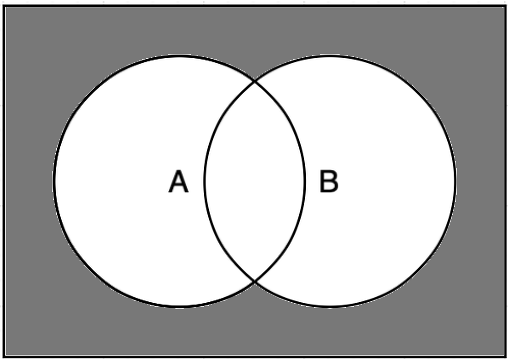

# 1

**Use Venn diagrams to show Demorgan’s law, i.e.,**

**a) $(A \cup B)^c = A^c \cap B^c$**

{width=50%}


**b) $(A \cap B)^c = A^c \cup B^c$**

{width=50%}

# 2
**a ) Let $A$ and $B$ be two events in a sample space for which $P(A) = 1/3$, $P(B) = 1/6$, and $P(A\cap B) = 1/9$. What is $P(A \cup B)$?**

We use the "probability of a union":
$$
\mathrm{P}(A \cup B)=\mathrm{P}(A)+\mathrm{P}(B)-\mathrm{P}(A \cap B) = 1/3 + 1/6 - 1/9 = 7/18
$$

**b)  Let $C$ and $D$ be two events for which one knows that $P(C) = 0.1$, $P(D) = 0.3$, and $P(C \cap D) = 0.05$. What is $P(C \cap D^c)$?**

From probabilities of non-disjoint events, we know that 
$$
P(C) = P(C\cap D) + P(C\cap D^c)
$$
Rearranging gives us
$$
P(C \cap D^c) = P(C) - P(C \cap D) = 0.1 - 0.05 = 0.05
$$


# 3

**Consider tossing a fair coin for three times.**

**a) Write down the sample space $\Omega$.**

$$
\Omega = \{HHH,HHT,HTH,HTT,THH,THT,TTH,TTT\}
$$

**Then, write down the set of outcomes and probabilities for the the events**

**b) “We throw tails exactly two times”**

The outcomes for which this is true are $B = \{HTT,THT,TTH\}$

Since there are 8 total outcomes, we have 
$$
P(B) = 3/8
$$

**c) “We throw heads at least twice"**

The outcomes for which this is true are $C = \{HHH,HHT,HTH,THH\}$
$$
P(C) = 1/2
$$
**d) “Both the first and last throws is heads”**

The outcomes for which this is true are $D =\{HHH,HTH\}$
$$
P(D) = 1/4
$$
**e) “We get no tails at all”**

This is only true for $E =\{HHH\}$
$$
P(E) = 1/8
$$

# 4

**Consider tossing a coin repeatedly. Let the probability for heads be $p$, where $0 < p < 1$, and for tails $1 - p$.**

**Now consider that you are interested in the outcome when you’ll get the heads exactly for the third time.**

**(a) What would you consider as the sample space in this case**

$$
\Omega = \{3,4,...,\infty\}
$$

**(b) Write down the probability that it will take seven tosses to reach the outcome.**

Let's use the random variable $X$ to denote the number of successes in the first 6 tosses. $X$ then follows a $\text{Bin}(6,p)$ distribution. The probability of getting exactly 2 successes in the first 6 tosses is then
$$
P(X = 2) = \binom{6}{2}p^2(p-1)^4
$$
The 7th toss needs to be a success. Since this is independent of getting 2 successes in the first 6 tosses, we can obtain the probability of it taking exactly 7 tosses for us to reach 3 successes by multiplying $P(X=2)$ by $p$. Let's denote that event by $E$:

$$
P(E) = \binom{6}{2}p^3(p-1)^4
$$

# 5

**The rule $P(A \cup B) = P(A) + P(B) - P(A \cap B)$ is often useful to compute the probability of the union of the events. What would be the corresponding rule for three events $A$, $B$, and $C$? It should start with**

$$
P (A \cup B \cup C) = P (A) + P (B) + P (C) - ...
$$
**Hint: start from looking at the Venn diagrams to derive the result.**

This is the Venn diagram we want to obtain:

{width=50%}

If we start with $P (A) + P (B) + P (C)$, we see that we have  counted some of the areas of the diagram more than once. In the Venn diagram below, I have shown how many times each area has been counted:

{width=50%}

If we subtract $P(A\cap B)$, $P(B \cap C)$ and $P(A \cap C)$ from the sum, we are almost there. $P(A) + P(B) + P(C) - P(A\cap B) - P(B\cap C) - P(A \cap C)$:

{width=50%}

If we just add $P(A \cap B \cap C)$, we have the right result. Thus
$$
P(A\cup B \cup C) = P(A) + P(B) + P(C) - P(A\cap B) - P(B\cap C) - P(A \cap C) + P(A\cap B \cap C)
$$

# 6

**Use R as you would use a calculator to find numeric answers to the following expressions**

**a)**   $1+2(3+4)$

```{r}
1 + 2 * (3+4)
```

**b)** $43 + 32+1$

```{r}
4**3 + 3**(2+1)
```

**c)** $\sqrt{(4+3)(2+1)}$
```{r}
sqrt((4+3)*(2+1))
```

**d)** $\frac{1+2 \cdot 3^{4}}{5 / 6-7}$

```{r}
(1+2*3**4) / ((5/6)-7)
```

**e)** $\frac{0.25-0.2}{\sqrt{0.2 \cdot(1-0.2) / 100}}$

```{r}
(0.25-0.2) / sqrt(0.2 * (1-0.2)/100)
```


