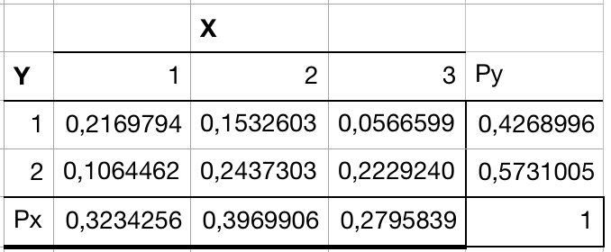

T = Theoretical Exercise, R = R Exercise

# Preparation

* Read pages 92, 96--99, 102--108, 111--113, 132--139 from @Verzani2014.

# Problems

## 1. Hair vs. Eye Colour (T)

To investigate the relations between hair color and eye colour, the hair color and eye color of 5383 was recorded. The data are given in Table 1. Eye color is encoded by the values 1 (Light) and 2 (Dark), and hair color by 1 (Fair/red), 2 (Medium), and 3 (Dark/black). By dividing the numbers in the table by 5383, the tble is turned into a joint probability distribution for random variables X (hair color) taking values 1 to 3 and Y (eye color) taking values 1 and 2.

```{r, echo=FALSE}
co <- matrix(c(1168,825,305,573,1312,1200),byrow=TRUE,nrow=2)
rownames(co)<-c("Light","Dark")
colnames(co)<-c("Fair/Red","Medium","Dark/black")
dimnames(co)<-list("Eye color"=rownames(co),"Hair color"=colnames(co))

library(knitr)
library(kableExtra)
kable(co, format = "latex", caption = "Relation between hair color and eye color.", booktabs = T) %>%
  kable_styling() %>%
  add_header_above(c(" ", "Hair color" = 3), bold = T) %>%
  group_rows(index = c("Eye color" = 2)) 
```


(a) Determine the joint and marginal probability distributions of $X$ and $Y$.

The joint distribution of $X$ and $Y$ is the same table, but each number is divided by 5383 in order to obtain a valid probability distribution. See Table 2.

```{r, echo=FALSE}
pmf <- matrix(c(1168,825,305,573,1312,1200)/5383,byrow=TRUE,nrow=2)
rownames(pmf)<-c("1 ","2 ")
colnames(pmf)<-c("1","2","3")
dimnames(pmf)<-list("Y"=rownames(pmf),"X"=colnames(pmf))


kable(pmf, format = "latex", caption = "Joint PMF of X and Y", booktabs  = T) %>%
  kable_styling(latex_options = "hold_position") %>%
  add_header_above(c(" ", "X" =3), bold = T) %>%
  group_rows(index = c("Y" = 2)) 
```
To determine the marginal distribution of $X$, we marginalize $Y$ out, i.e. for each value $x$ that $X$ can take on, we find $P(X=x)$ by summing over all the values that $Y$ can take. 

$$
P(X)=\sum_y P(X,Y=y)
$$

Similarly, to determine the marginal distribution of $Y$, we marginalize $X$ out, i.e. for each value $y$ that $Y$ can take on, we find $P(Y=y)$ by summing over all the values that $X$ can take:

{width=50%}


(b) Find out whether $X$ and $Y$ are dependent or independent. 

$X$ and $Y$ are independent if and only if $P(X=x,Y=y) = P(X=x)P(Y=y)$ for all $x$ and $y$.

Let's check for $x=1$ and $y=1$
$$
\begin{aligned}
&P(X=1,Y=1) = 0.217\\
&P(X=1)P(Y=1) = 0.323\cdot0.427=0.138
\end{aligned}
$$
Since $P(X=x,Y=y) \neq P(X=x)P(Y=y)$, $X$ and $Y$ are dependent.

## 2. Joint distribution (T)

Let X and Y be continuous random variables with the joint probability density function
\begin{equation}
  f(x,y)=\left\{\begin{tabular}{ll} $cx+1$ & if $x,y\geq0,x+y<1$ \\ 0 & otherwise. \end{tabular}\right.
\end{equation}


(a) Find the constant c. 

We know that any continuous distribution must integrate to 1. To find the value of $c$, we therefore integrate out $x$ and $y$.

$x$ and $y$ can only attain values in the interval [0,1[, as we know $x,y\geq0$ and $x+y<1$. The only hurdle here is the constraint that $x$ and $y$ must sum to 1. To satisfy this constraint, we fix a value for $x$ between 0 and 1 in the integral and integrate $y$ from 0 to $1-x$:


$$
\begin{aligned}
&\int_0^1\int_0^{1-x}cx+1 \text{ d}y \text{ d}x\\
=&\int_0^1\left[cxy+y \right]^{1-x}_0\text{ d}x\\
=&\int_0^1cx(1-x) + 1 - x \text{ d} x\\
=&\int_0^1cx(1-x)\text{ d}x+\int_0^1 1-x\text{ d} x\\
=&\left[-c\left(\frac13 x^3-\frac12x^2\right)\right]^1_0 + \left[x-\frac12x^2\right]^1_0\\
=&\frac{-c}{3} + \frac c2+\frac12\\
=&\frac c6+\frac12
\end{aligned}
$$


We can now isolate $c$:
$$
\begin{aligned}
\frac c6+\frac12 &=1\\
\frac c6 &= \frac12\\
c &=3
\end{aligned}
$$


(b) Compute the marginal distribution $f_X(x)$.

We get the marginal distribution $f_X(x)$ by integrating $f(x,y)$ with respect to $y$ in the interval [0,x] in order to satisfy the constraint that $x+y<1$. By now, we also know that $c=3$, so let's include that in the distribution:

$$
\begin{aligned}
f_X(x) &= \int_0^{1-x}3x+1 \text{ d}y\\
&=[ 3xy+y  ]^{1-x}_0\\
&=3x(1-x) + 1 - x
\end{aligned}
$$

(c) Compute $P(Y<2X^2)$.


```{r}
x <- seq(0,1,length.out=100)
y <- seq(0,1,length.out=100)

f = function(x,y)
  {
    if (x>=0 & y>=0 & y+x<1) {3*x+1}
    else {0}
  }

z = matrix(data=NA, nrow=length(x), ncol=length(y))

for(i in 1:length(x))
{
  for(j in 1:length(y))
  {
z[i,j] = f(x[i],y[j]) 
  }
}
# Visualization
library(plot3D)
persp3D(x,y,z,theta=30, phi=30, axes=TRUE,scale=1, box=TRUE, nticks=2, 
        ticktype="detailed", xlab="x", ylab="y", zlab="f(x,y)", 
        main="")

```

*Don't know how to do this, but here's the solution from the solutions folder:*

```{r}
x <- seq(0,1,length.out = 100)
plot(x,1-x,"l",ylab = "y", col = "red")
lines(x,2*x^2,col = "blue")
legend("top", legend=c("1-x", "2x^2"),
       col=c("red", "blue"), lty=1:2, cex=0.8)

```

We first have to find the subset of values that satisfy that inequality, we do this by finding the intersection between the values below the curve $2X^2$ and the values below the line $1-X$, which is the original set. Having those in mind, we need to find where do they intersect:

$$
\begin{split}
y &= 1 - x\\
y &= 2x^2\\
1-x &= 2x^2\\
2x^2 - x + 1 &= 0\\
x &= \frac{1}{2} \text{(Ignoring the negative solution)}
\end{split}
$$
From this we know that the area we need to integrate is below $2X^2$ up to $\frac{1}{2}$, and then is below the original set, $1-X$:

$$
\begin{split}
P(Y < 2X^2) &= \int_{0}^{\frac{1}{2}}{\int_{0}^{2x^2}3x + 1\ dy}\ dx + \int_{\frac{1}{2}}^{1}{\int_{0}^{1-x}3x + 1\ dy}\ dx =\\ 
&= \int_{0}^{\frac{1}{2}}\Big[(3xy + y)\Big]_{0\ \text{(On y)}}^{2x^2}\ dx + \int_{\frac{1}{2}}^{1}\Big[(3xy + y)\Big]_{0\ \text{(On y)}}^{1-x}\ dx = \\
&= \int_{0}^{\frac{1}{2}} 6x^3 + 2x^2\ dx + \int_{\frac{1}{2}}^{1} -3x^2 + 2x + 1\ dx =\\
&= \Big[\frac{6}{4}x^4 + \frac{2}{3}x^3 \Big]_0^{\frac{1}{2}} + \Big[-x^3 + x^2 + x\Big]_{\frac{1}{2}}^{1} \\
&= \frac{17}{96} + \frac{3}{8} = \frac{53}{96} \approx 0.55
\end{split}
$$


## 3. Covariance and Correlation (T)

Show that the correlation between X and Y is simply the covariance of the corresponding standardised scores, i.e, 
\begin{equation}
\rho(X,Y) = \mathrm{Cov}\left [\frac{X-E[X]}{ \sqrt{\mathrm{Var}[X]}}, \frac{Y-E[Y]}{ \sqrt{\mathrm{Var}[Y]}} \right].
\end{equation}

The correlation between X and Y is defined as
$$
\rho(X,Y) = \frac{\mathrm{Cov}(X,Y)}{\sqrt{\mathrm{Var}(X)\mathrm{Var}(Y)}}
$$
The covariance between X and Y is defined as

$$
\mathrm{Cov}(X,Y)=E[(X-E[X])(Y-E[Y])]=\mathrm{E}[XY]-\mathrm{E}[X]\mathrm{E}[Y]
$$


Thus, the covariance between the two quantities in the exercise definition is
$$
\begin{aligned}
&\mathrm{Cov}\left [\frac{X-E[X]}{ \sqrt{\mathrm{Var}[X]}}, \frac{Y-E[Y]}{ \sqrt{\mathrm{Var}[Y]}} \right]\\
=&E\left[\frac{(X-E[X])(Y-E[Y])}{\sqrt{\mathrm{Var}[X]}\sqrt{\mathrm{Var}[Y]}}\right] - E[X-E[E]]E[Y-E[Y]]
\end{aligned}
$$
The expectation of a random variable minus its expectation is 0, so we have $\mathrm{E}[X-\mathrm{E}[X]]=\mathrm{E}[Y-\mathrm{E}[Y]]=0$. 
$$
\begin{aligned}
&E\left[\frac{(X-E[X])(Y-E[Y])}{\sqrt{\mathrm{Var}[X]}\sqrt{\mathrm{Var}[Y]}}\right] - E[X-E[E]]E[Y-E[Y]]\\
=&E\left[\frac{(X-E[X])(Y-E[Y])}{\sqrt{\mathrm{Var}[X]}\sqrt{\mathrm{Var}[Y]}}\right] -0\cdot0\\
=&E\left[\frac{(X-E[X])(Y-E[Y])}{\sqrt{\mathrm{Var}[X]\mathrm{Var}(Y)}}\right]
\end{aligned}
$$
We can view $\frac1{\sqrt{\mathrm{Var}[X]\mathrm{Var}(Y)}}$ as a constant factor, and we can therefore use the property linearity of expectations:

$$
\begin{aligned}
&E\left[\frac{(X-E[X])(Y-E[Y])}{\sqrt{\mathrm{Var}[X]\mathrm{Var}(Y)}}\right]\\
=&\frac1{\sqrt{\mathrm{Var}[X]\mathrm{Var}(Y)}}E\left[(X-E[X])(Y-E[Y])\right]\\
=&\frac{E\left[(X-E[X])(Y-E[Y])\right]}{\sqrt{\mathrm{Var}[X]\mathrm{Var}(Y)}}\\
=&\frac{\mathrm{Cov(X,Y)}}{\sqrt{\mathrm{Var}[X]\mathrm{Var}(Y)}} \text{ (by the definition of covariance)}
\end{aligned}
$$


## 4. Correlation Coefficient (R)

(a) The data set `normtemp (UsingR)` contains body measurements for 130 healthy, randomly selected individuals. The variable `temperature` measures normal body temperature, and the variable `hr` measures resting heart rate. Make a scatter plot of the two variables. What does the plot show you? Find the Pearson correlation coefficient. How does the estimate relate to the scatter plot?

```{r}
require(UsingR)
plot(normtemp$temperature,
     normtemp$hr,
     main = "Scatterplot of body temperature against heart rate",
     xlab = "Temperature",
     ylab = "Heart rate")
```
The plot shows that there does not seem to be a strong correlation between body temperature and heart rate. There may be a slight positive correlation. Let's calculate the correlation coefficient to test this hypothesis:
```{r}
cor(normtemp$temperature,normtemp$hr)
```
We have a Pearson correlation of 0.25. A positive correlation coefficient means that an increase in body temperature will result in an increase in heart rate, which was also our suspicion.


(b) The data set `nym.2002 (UsingR)` contains information about the 2002 New York city marathon. What do you expect the correlation between age and finishing time to be? Make a scatter plot and compute the correlation coefficient. Does the result match your expectation? 

I expect age to be positively correlated with the finishing time, i.e. the older you are, the slower you will run.

```{r}
plot(nym.2002$age,
     nym.2002$time,
     main = "Scatterplot of age and finish time",
     xlab = "Age",
     ylab = "Finish time")
```
```{r}
cor(nym.2002$age,nym.2002$time)
```
We see a positive correlation, which confirms the hypothesis.


(c) The `batting` set (`UsingR`) data set contains baseball statistics for the 2002 Major League Baseball season. What is the correlation between the number of strikeouts (`SO`) and the number of home runs (`HR`)? Make a scatter plot to see whether there is any trend. Does the data suggest that in order to hit a lot of home runs one should strike out a lot?

```{r}
cor(batting$SO,batting$HR)
```
```{r}
plot(batting$SO,
     batting$HR,
     main = "Scatterplot of number of strikeouts and number of home runs",
     xlab = "Strikeouts",
     ylab = "Home runs")
```
With a correlation coefficient of 0.7, it seems that if you strike out a lot, you will also hit a lot of home runs. Wikipedia confirms this hypothesis: *Although a strikeout suggests that the pitcher dominated the batter, the free-swinging style that generates home runs also leaves batters susceptible to striking out. Some of the greatest home run hitters of all time—such as Alex Rodriguez, Reggie Jackson, and Jim Thome—were notorious for striking out.* (https://en.wikipedia.org/wiki/Strikeout)


## 5. Sampling from a Joint Probability Distribution (R)

Let $X$ and be $Y$ be continuous random variables with the joint probability density function $f(x,y)$. In general, one can draw samples $(x^{(n)},y^{(n)})$ from the joint probability density of two random variables factoring the probabity density as $f(x,y)=f(y|x) f(x)$ and first drawing a sample $x^{(n)}$ for $X$ from the marginal density $f(x)$ and then the sample $y^{(n)}$ for $Y$ from the conditional density $f(y|x)$ conditioned on $x=x^{(n)}$.

Now, assume that $f(x)=1$ for $0<x<1$, $f(x)=0$ otherwise; and 
\begin{equation}
f(y|x)=  \left\{ \begin{tabular}{ll}
                  $y - x+ 1$ & if $-1+ x \leq y < x$ \\
                  $-y + x + 1$ & if $x \leq y < 1+x$ \\
                  0 & otherwise.
               \end{tabular}\right.
\end{equation}

Implement a computer program that draws samples from $f(x,y)$ by using the random number generator for uniformly distributed random variables in R.
 
**Solution attempt**
The first step is to find the CDF for $f(y|x)$. For this purpose we can think of $f(y|x)$ as just at distribution over $y$ and think of $x$ as some "constant" parameter. 

We would like to find:
$$
F(y|x) = \int_{-\infty}^y f(y|x) dy 
$$
Now we have two intervals. First if $-1+ x \leq y < x$ then 

$$
F(y|x) = \int_{-1+ x}^y f(y|x) dy = \int_{-1+ x}^y (y-x+ 1) dy = \frac{1}{2}(x-y-1)^2
$$
And if $x \leq y < 1+x$
$$
F(y|x) = \int_{-\infty}^y f(y|x) dy = \int_{-1+ x}^x f(y|x) dy + \int_{x}^y f(y|x) dy 
$$
$$
= \frac{1}{2} + \int_{x}^y(-y + x + 1) dy
= \frac{1}{2} - \frac{(x-y)^2}{2} - x + y
$$

Now the next step is to find the inverse distribution functions. 

If we invert (set $F(y|x) = u$ and solve for y) the first part we get


$$
y = F^{inv}(u) = x + \sqrt{2u} - 1  \quad \text{for} \quad -1+ x \leq y < xb
$$
Here the condition $$-1+ x \leq y < x$$ translates to $$0 \leq u \leq \frac{1}{2}$$.

For the second part we get
$$
y = F^{inv}(u) =  x - \sqrt{2-2u}+1  \quad \text{for} \quad x \leq y < x + 1 
$$
with the condition $$x \leq y < x + 1$$ translating to $$\frac{1}{2} \leq u < 1$$ 


So we conclude that 


$$
F^{inv}(u)  = \begin{cases}
x + \sqrt{2u} - 1 \quad &\text{for} \quad  0 \leq u \leq \frac{1}{2} \\
x - \sqrt{2-2u} +1   \quad &\text{for} \quad \frac{1}{2} \leq   u  < 1 \\
0 & \text{otherwise } 
\end{cases}
$$
Now that we have the inverse distribution function we can sample by first sampling $x\sim U(0,1)$ then plug that value into $F^{inv}$ as a parameter. 
Then we sample $u\sim U(0,1)$ and use that to generate a sample $y\sim f(y|x)$

```{r}

F.inv.1 <- function(u, x) 
{x + sqrt(2*u) - 1}

F.inv.2 <- function(u, x) 
{x - sqrt(2-2*u)+1}

F.inv <- function(u,x) {
  if (u <= 0.5) 
    {F.inv.1(u,x)}
  else 
    {F.inv.2(u,x)}
}

N.SAMPLES <- 10000
x <-rep(0,N.SAMPLES )
# x <- runif(N.SAMPLES)
u <- runif(N.SAMPLES)

y <- numeric(N.SAMPLES)
for (i in 1:N.SAMPLES) {
  y[i]<-  F.inv(u[i],x[i]) 
}

plot(x,y)

densityplot(y)
```

 
<!-- This is probably wrong... I guess $f(y|x)$ is a PMF? Also I feel like we need to know the distribution of $y$ in order to sample from $f(y|x)$. I'll assume that it is a U(0,1) distribution -->


<!-- ```{r} -->
<!-- N.SAMPLES <- 1000 -->

<!-- x <- runif(N.SAMPLES) -->
<!-- y.given.x <- rep(0,N.SAMPLES) -->
<!-- for (i in 1:N.SAMPLES){ -->
<!--   y <- runif(1) -->
<!--   if (-1+x[i]<=y && y<x[i]){ -->
<!--     y.given.x[i] <- y-x[i]+1 -->
<!--   } -->
<!--   else if (x[i]<=y && y<1+x[i]){ -->
<!--     y.given.x[i] <- -y+x[i]+1 -->
<!--   } -->
<!--   else y.given.x[i] <- 0 -->
<!-- } -->
<!-- plot(x,y.given.x) -->


<!-- ``` -->
 


## 6. Covariance, Correlatedness and Independence (R)

Load the data set by copying the data file from course webpage to your working directory and typing `load("mypnts.Rdata")`. 
```{r}
load("mypnts.Rdata")
```


(a) Make a scatter plot of the points. Are the $x$ and $y$ coordinates correlated?
```{r}
plot(mypnts$x,
     mypnts$y,
     main = "Scatterplot x and y",
     xlab = "x",
     ylab = "y")
```
They look negatively correlated. Let's check the correlation coefficient:
```{r}
cor(mypnts$x,mypnts$y)
```
Yep

(b) Estimate the *covariance matrix* of the data set. It is a $2 \times 2$ matrix containing the all the pairwise covariances, i.e., 
\begin{equation}
\mathbf{C} = 
\begin{pmatrix} \mathrm{Cov}(X,X)\quad \mathrm{Cov}(X,Y)\\
                \mathrm{Cov}(Y,X)\quad \mathrm{Cov}(Y,Y)
\end{pmatrix}
\end{equation}
What can you see from the covariance matrix estimate?
```{r}
cov(mypnts)
```
We see that x has a variance of 68, y has a variance of 388, and x and y have a covariance of -162.


(c) Apply the mapping
\begin{equation}
x' = a x + b y \quad \text{and} \quad y'=c x + d y,
\end{equation}
to the points where $a=0.07$, $b=0$, $c=1$,and $d=0.42$. This process is called *whitening*. 

```{r}
a <- 0.07
b <- 0
c <- 1
d <- 0.42
xm <- a*mypnts$x + b*mypnts$y
ym <- c*mypnts$x + d*mypnts$y
```


(d) Plot the mapped points (use the option 'asp=1' that gives unity aspect ratio), and their marginal distributions (`densityplot`) on both $x'$ and $y'$ axis. Compute the covariance matrix estimate for the mapped points. Are the mapped points uncorrelated? How about independent? Can you see why the mapping is called whitening?

```{r}
require(lattice)
plot(xm,ym,
     main = "Scatterplot of x' and y'",
     xlab = "x'",
     ylab = "y'",
     asp=1,
     pch="*")
densityplot(xm)
densityplot(ym)
```
```{r}
cov(data.frame(xm,ym))
```
Since we have supposedly whitened the data, we should have obtained an identity matrix. We have thus not really whitened the data

Using the r package 'whitening' (needs to be installed), we get a different data matrix after transforming the data:

```{r}
plot(whitening::whiten(as.matrix(mypnts)),asp=1)
cov(whitening::whiten(as.matrix(mypnts)))
```
This is how the data should have been transformed

Nonetheless, x' and y' are now somewhat uncorrelated. However, they are not independent, as for instance knowing that $x'=-1$ narrows down the possibilities for $y$ by a lot.

The mapping is called whitening, because we tranform the data into white noise vectors.


(e) Apply rotation to the mapped points 
\begin{equation}
x'' = cos(\alpha) x' - sin(\alpha) y' \quad \text{and} \quad y''=sin(\alpha) x' +  cos(\alpha)y',
\end{equation}
where $\alpha=-\pi/6$.

Plot the rotated, mapped points, and the marginals on the new axes. Are the rotated, mapped coordinates uncorrelated? How about independent? 

```{r}
alpha = -pi/6
xmm<- cos(alpha)*xm - sin(alpha)*ym
ymm<- sin(alpha)*xm + cos(alpha)*ym
plot(xmm,
     ymm,
     main = "Scatterplot of x'' and y''",
     xlab = "x''",
     ylab = "y''",
     asp = 1)
cor(data.frame(xmm,ymm))
```
Now they are almost uncorrelated. They are also now independent, as the value of x'' tells you nothing about the value of y''.


(f) What did you learn from this exercise? Does the result generalise?

You can transform a  highly correlated variables into uncorrelated, independent variables with a mean of 0 and a variance of 0 and yeah, I think the result does generalize


